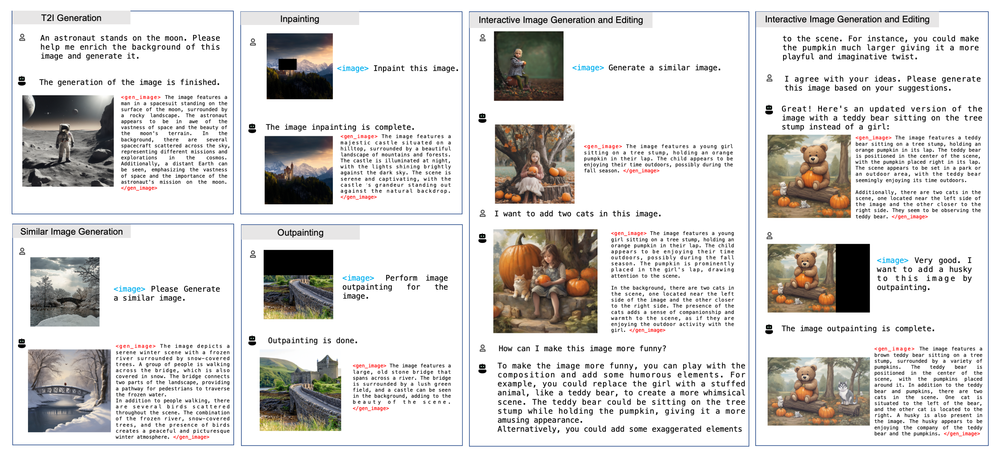
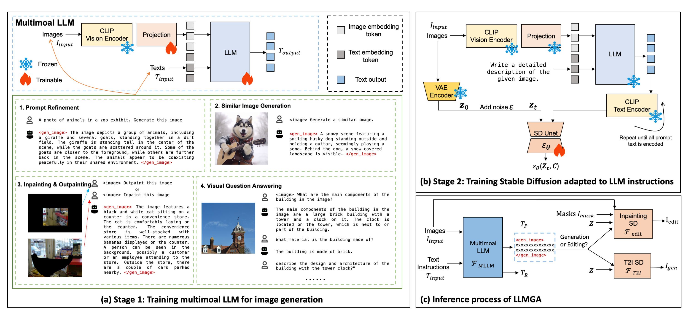
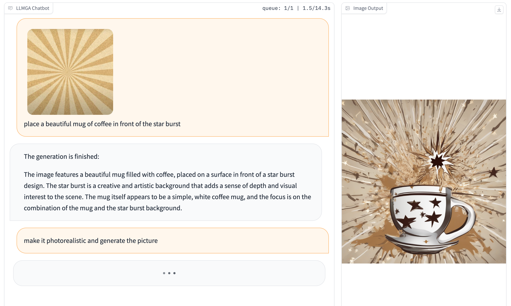
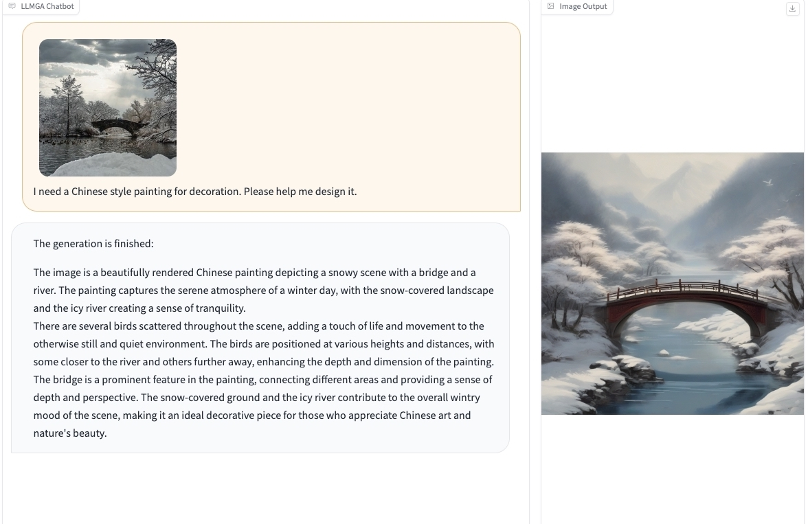

<p align="center" width="10%">
 
</p>


# LLMGA: Multimodal Large Language Model based Generation Assistant

[Bin Xia](https://scholar.google.com/citations?user=rh2fID8AAAAJ&hl=zh-CN), [Shiyin Wang](), [Yingfan Tao](https://scholar.google.com/citations?user=GYDnPdQAAAAJ&hl=zh-CN&oi=ao), [Yitong Wang](https://scholar.google.com/citations?user=NfFTKfYAAAAJ&hl=zh-CN), and [Jiaya Jia](https://scholar.google.com/citations?user=XPAkzTEAAAAJ&hl=zh-CN&oi=ao)

<a href="https://llmga.github.io/"></a>
<a href='https://72379d10f6842705f3.gradio.live'></a>
<a href="https://arxiv.org/pdf/2311.16500.pdf"></a> 
<a href='https://huggingface.co/binxia'></a>
<a href='https://huggingface.co/binxia/LLMGA-dataset'></a>

## News
- [x] [2023.12.20]   🔥 We release LLMGA's [training datasets](https://huggingface.co/binxia/LLMGA-dataset).
- [x] [2023.12.20]    We release the gradio codes of LLMGA7b-SDXL-T2I.
- [x] [2023.12.08]   🔥 We release LLMGA7b-SDXL-T2I [demo](https://72379d10f6842705f3.gradio.live).
- [x] [2023.11.30]   We have released the code for DiffRIR. It can effectively eliminate differences in brightness, contrast, and texture between generated and preserved regions in inpainting and outpainting. Considering its applicability to projects beyond LLMGA, we have open-sourced it at [Github](https://github.com/Zj-BinXia/DiffRIR).
- [x] [2023.11.29]   🔥 The models is released at [Huggingface](https://huggingface.co/binxia).
- [x] [2023.11.29]   🔥 The training and inference code is released.
- [x] [2023.11.29]  We will upload all models, code, and data within a week and further refine this project.
- [x] [2023.11.28]   🔥 GitHub repo is created.

---

> **Abstract:** In this paper, we introduce a Multimodal Large Language Model-based Generation Assistant (LLMGA), leveraging the vast reservoir of knowledge and proficiency in reasoning, comprehension, and response inherent in Large Language Models (LLMs) to assist users in image generation and editing. Diverging from existing approaches where Multimodal Large Language Models (MLLMs) generate fixed-size embeddings to control Stable Diffusion (SD), our LLMGA provides a detailed language generation prompt for precise control over SD. This not only augments LLM context understanding but also reduces noise in generation prompts, yields images with more intricate and precise content, and elevates the interpretability of the network. To this end, we curate a comprehensive dataset comprising prompt refinement, similar image generation, inpainting & outpainting, and visual question answering. Moreover, we propose a two-stage training scheme. In the first stage, we train the MLLM to grasp the properties of image generation and editing, enabling it to generate detailed prompts. In the second stage, we optimize SD to align with the MLLM's generation prompts. Additionally, we propose a reference-based restoration network to alleviate texture, brightness, and contrast disparities between generated and preserved regions during image editing. Extensive results show that LLMGA has promising generative capabilities and can enable wider applications in an interactive manner.

---

## Contents
- [Demo](#demo)
- [Install](#install)
- [Model](#model)
- [Preparation](#Preparation)
- [Train](#train)
- [Inference](#inference)
- [TODO](#todo)
- [Citation](#citation)
- [Acknowledgement](#acknowledgement)

## Demo
We provide some selected examples in this section. More examples can be found in our [project page](https://llmga.github.io/). Feel free to try our online [demo](https://72379d10f6842705f3.gradio.live)!

<div align=center>

</div>

<div align=center>

</div>

## Install
Please follow the instructions below to install the required packages.
1. Clone this repository
```bash
git clone https://github.com/dvlab-research/LLMGA.git
```

2. Install Package
```bash
conda create -n llmga python=3.9 -y
conda activate llmga
cd LLMGA
pip install --upgrade pip  # enable PEP 660 support
pip install -e .
cd ./llmga/diffusers
pip install . 
```

3. Install additional packages for training cases
```bash
pip install datasets
pip install albumentations
pip install ninja
pip install flash-attn --no-build-isolation
```

## Model


<div align=center>

</div>


## Preparation

### Training Dataset
We provide the processed image-based data for LLMGA training. We organize the data in the format of LLaVA, please organize the training image-based data following [this](https://github.com/haotian-liu/LLaVA/blob/main/docs/Data.md).

please download [Laion-aesthetic dataset](https://huggingface.co/datasets/ChristophSchuhmann/improved_aesthetics_6.25plus), [COCO2017 dataset](http://images.cocodataset.org/zips/train2017.zip), and [LLMGA dataset](https://huggingface.co/binxia/LLMGA-dataset) and organize them as in [Structure](#structure).


### Training Pretrained Weights
We recommend users to download the pretrained weights from the following [link](https://ai.meta.com/llama/), and put them in `checkpoints` following [Structure](#structure).


### Inference Pretrained Weights

Please download MLLM Models and SD models from the following links. For example, you can download [LLMGA-MLLM7b](https://huggingface.co/binxia/llmga-llama-2-7b-chat-full-finetune) and [LLMGA-SDXL-T2I](https://huggingface.co/binxia/llmga-sdxl-t2i) to realize LLMGA7b-T2I functionality. Please organize them as in [Structure](#structure).


<table>
  <tr>
    <th align="left">MLLM Model</th>
    <th align="center">Pretrained Models</th>
  </tr>
  <tr>
    <td align="left">LLMGA-MLLM7b</td>
    <td align="center"><a href="https://huggingface.co/binxia/llmga-llama-2-7b-chat-full-finetune">Download</a></td>
  </tr>
  <tr>
    <td align="left">LLMGA-MLLM13b</td>
    <td align="center"><a href="https://huggingface.co/binxia/llmga-llama-2-13b-chat-full-finetune">Download</a></td>
  </tr>
</table>

<table>
  <tr>
    <th align="left">SD Model</th>
    <th align="center">Pretrained Models</th>
  </tr>
  <tr>
    <td align="left">LLMGA-SD15-T2I</td>
    <td align="center"><a href="https://huggingface.co/binxia/llmga-sd15-t2i">Download</a></td>
  </tr>
  <tr>
    <td align="left">LLMGA-SD15-Inpainting</td>
    <td align="center"><a href="https://huggingface.co/binxia/llmga-sd15-inpainting">Download</a></td>
  </tr>
  <tr>
    <td align="left">LLMGA-SDXL-T2I</td>
    <td align="center"><a href="https://huggingface.co/binxia/llmga-sdxl-t2i">Download</a></td>
  </tr>
  <tr>
    <td align="left">LLMGA-SDXL-Inpainting</td>
    <td align="center"><a href="https://huggingface.co/binxia/llmga-sdxl-inpainting">Download</a></td>
  </tr>
</table>

### Structure

The folder structure should be organized as follows before training.

```
LLMGA
├── llmga
├── scripts
├── work_dirs
├── checkpoints
│   ├── Training
│   ├── Inference
│   │   ├── llmga-llama-2-7b-chat-full-finetune
│   │   ├── llmga-llama-2-13b-chat-full-finetune
│   │   ├── llmga-sdxl-t2i
│   │   ├── llmga-sdxl-inpainting
│   │   ├── llmga-sd15-t2i
│   │   ├── llmga-sd15-inpainting
├── data
│   │── LLMGA-dataset
│   │── LAION-Aesthetic
│   ├── COCO
│   │   ├── train2017

```


## Train

LLMGA is trained on 8 A100 GPUs with 80GB memory. To train on fewer GPUs, you can reduce the `per_device_train_batch_size` and increase the `gradient_accumulation_steps` accordingly. Always keep the global batch size the same: `per_device_train_batch_size` x `gradient_accumulation_steps` x `num_gpus`.

Please make sure you download and organize the data following [Preparation](#Preparation) before training.

### First Stage Training

train LLMGA based on LLaMA2-7b
```bash
bash train_LLMGA_7b_S1.sh
```
or train LLMGA based on LLaMA2-13b
```bash
bash train_LLMGA_13b_S1.sh
```

### Second Stage Training

train LLMGA based on SD1.5-T2I
```bash
bash train_LLMGA_SD15_S2.sh
```

train LLMGA based on SD1.5-Inpainting
```bash
bash train_LLMGA_SD15_S2_inpaint.sh
```

train LLMGA based on SDXL-T2I
```bash
bash train_LLMGA_SDXL_S2.sh
```

train LLMGA based on SDXL-Inpainting
```bash
bash train_LLMGA_SDXL_S2_inpaint.sh
```

## Inference

### CLI Inference

Use LLMGA without the need of Gradio interface. It also supports multiple GPUs, 4-bit and 8-bit quantized inference. With 4-bit quantization.
Please try this for inference:

test LLMGA7b-SDXL for T2I with image input at first. You can ask LLMGA to assist in T2I generation around your input image.
```bash
python3 -m llmga.serve.cli-sdxl \
    --model-path ./checkpoints/llmga-llama-2-7b-chat-full-finetune  \
    --sdmodel_id ./checkpoints/llmga-sdxl-t2i \
    --save_path ./exp/llmga7b-sdxl \
    --image-file /PATHtoIMG
```

test LLMGA7b-SDXL for Inpainting with image input at first. You can ask LLMGA to assist in inpainting or outpainting around your input image.
```bash
python3 -m llmga.serve.cli-sdxl-inpainting \
    --model-path ./checkpoints/llmga-llama-2-7b-chat-full-finetune  \
    --sdmodel_id ./checkpoints/llmga-sdxl-inpainting \
    --save_path ./exp-inpainting/llmga7b-sdxl \
    --image-file /PATHtoIMG \
    --mask-file /PATHtomask
```

test LLMGA7b-SDXL for T2I generation without image input at first. You can ask LLMGA to assist in T2I generation by only chatting.
```bash
python3 -m llmga.serve.cli2-sdxl \
    --model-path ./checkpoints/llmga-llama-2-7b-chat-full-finetune  \
    --sdmodel_id ./checkpoints/llmga-sdxl-t2i \
    --save_path ./exp2/llmga7b-sdxl \
```

### Gradio Inference
```bash
python3 llmga.serve.gradio_web_server.py \
    --model-path ./checkpoints/llmga-llama-2-7b-chat-full-finetune  \
    --sdmodel_id ./checkpoints/llmga-sdxl-t2i \
    --load-4bit \
    --model-list-mode reload \
    --port 8334 \
```

<div align=center>

</div>

<div align=center>

</div>

## TODO
- [x] Support gradio demo.


## Citation
If you find this repo useful for your research, please consider citing the paper
```
@article{xia2023llmga,
  title={LLMGA: Multimodal Large Language Model based Generation Assistant},
  author={Xia, Bin and Wang, Shiyin, and Tao, Yingfan and Wang, Yitong and Jia, Jiaya},
  journal={arXiv preprint arXiv:2311.16500},
  year={2023}
}
```

## Acknowledgement
We would like to thank the following repos for their great work:

- This work utilizes MLLM from [LLaVA](https://github.com/haotian-liu/LLaVA).
- This work utilizes Stable Diffusion from [diffusers](https://github.com/huggingface/diffusers).


